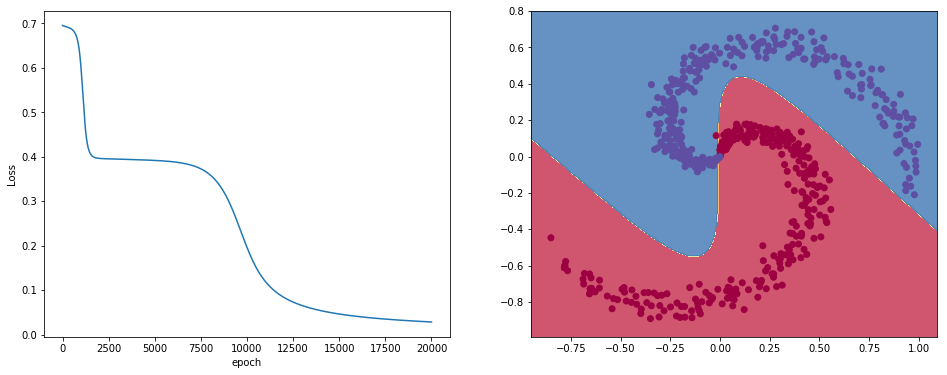

# ScratchNet

A from-scratch neural network implemented using only NumPy.

## Installation

```
conda install -c defusco scratchnet
```

## Quick start
This package includes a dataset generator.

```
from scratchnet.datasets import make_spiral

X, y = make_spiral(n_samples=600, n_features=2, n_classes=2)
```


Now we can create a multi-layer neural network

```
from scratchnet.networks import Network
from scratchnet.activations import Tanh, Sigmoid

model = Network(n_features=2)
model.add_layer(128, Tanh(), random_state=42)
model.add_layer(128, Tanh(), random_state=42)
model.add_layer(1, Sigmoid(), random_state=42)

```

And train the network according to the supplied loss function.

```
from scratchnet.losses import CrossEntropy

history = model.train(X, y, CrossEntropy(), epochs=20000)
print(model.score(X, y))
```

```
0.99
```

And finally let's plot the decision boundary.

```
from scratchnet.plots import decision_boundary

import matplotlib.pyplot as plt
fig, axes = plt.subplots(ncols=2, figsize=(16,6))

axes[0].plot(history)
axes[0].set_xlabel('epoch')
axes[0].set_ylabel('Loss')
decision_boundary(single_layer, X, y, ax=axes[1])
plt.plot()
```


